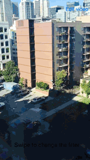
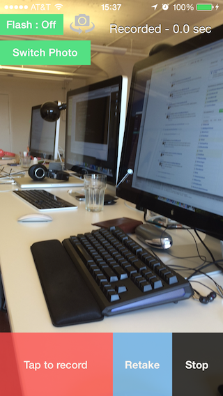
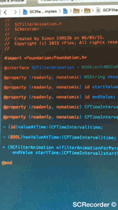

SCRecorder
===============





A Vine/Instagram like audio/video recorder and filter framework in Objective-C.

In short, here is a short list of the cool things you can do:
- Record multiple video segments
- Zoom/Focus easily
- Remove any record segment that you don't want
- Display the result into a convenient video player
- Save the record session for later somewhere using a serializable NSDictionary (works in NSUserDefaults)
- Add a configurable and animatable video filter using Core Image
- Add a UIView as overlay, so you can render anything you want on top of your video
- Merge and export the video using fine tunings that you choose


Examples for iOS are provided.

Want something easy to create your filters in this project? Checkout https://github.com/rFlex/CoreImageShop

Framework needed:
- CoreVideo
- AudioToolbox
- GLKit

Podfile
----------------

If you are using cocoapods, you can use this project with the following Podfile

```ruby
platform :ios, '7.0'
pod 'SCRecorder'
```

Manual install
----------------

Drag and drop the [SCRecorder.xcodeproject](Library/SCRecorder.xcodeproject) in your project. In your project, add the libSCRecorder.a dependency in the Build Phases into the "Link Binary with Librairies" section (as done in the example).

Swift
---------------

For using the project in Swift, follow either the Podfile or Manual install instructions (they both work on Swift too). Then, to allow SCRecorder to be accessible from Swift, just add the following line in your bridge header:
```objective-c
#import <SCRecorder/SCRecorder.h>
```

Easy and quick
----------------

[SCRecorder](Library/Sources/SCRecorder.h) is the main class that connect the inputs and outputs together. It processes the audio and video buffers and append them in a [SCRecordSession](Library/Sources/SCRecordSession.h).

```objective-c
// Create the recorder
SCRecorder *recorder = [SCRecorder recorder]; // You can also use +[SCRecorder sharedRecorder]
	
// Start running the flow of buffers
if (![recorder startRunning]) {
	NSLog(@"Something wrong there: %@", recorder.error);
}

// Create a new session and set it to the recorder
recorder.session = [SCRecordSession recordSession];

// Begin appending video/audio buffers to the session
[recorder record];

// Stop appending video/audio buffers to the session
[recorder pause];
```

Configuring the recorder
--------------------

You can configure the input device settings (framerate of the video, whether the flash should be enabled etc...) directly on the SCRecorder.

```objective-c
// Set the AVCaptureSessionPreset for the underlying AVCaptureSession.
recorder.captureSessionPreset = AVCaptureSessionPresetHigh;

// Set the video device to use
recorder.device = AVCaptureDevicePositionFront;

// Set the maximum record duration
recorder.maxRecordDuration = CMTimeMake(10, 1);

// Listen to the messages SCRecorder can send
recorder.delegate = self;
```

You can configure the video, audio and photo output settings in their configuration instance ([SCVideoConfiguration](Library/Sources/SCVideoConfiguration.h), [SCAudioConfiguration](Library/Sources/SCAudioConfiguration.h), [SCPhotoConfiguration](Library/Sources/SCPhotoConfiguration.h)),  that you can access just like this:
```objective-c

// Get the video configuration object
SCVideoConfiguration *video = recorder.videoConfiguration;

// Whether the video should be enabled or not
video.enabled = YES;
// The bitrate of the video video
video.bitrate = 2000000; // 2Mbit/s
// Size of the video output
video.size = CGSizeMake(1280, 720);
// Scaling if the output aspect ratio is different than the output one
video.scalingMode = AVVideoScalingModeResizeAspectFill;
// The timescale ratio to use. Higher than 1 makes a slow motion, between 0 and 1 makes a timelapse effect
video.timeScale = 1;
// Whether the output video size should be infered so it creates a square video
video.sizeAsSquare = NO;
// The filter to apply to each output video buffer (this do not affect the presentation layer)
video.filter = [SCFilter filterWithCIFilterName:@"CIPhotoEffectInstant"];

// Get the audio configuration object
SCAudioConfiguration *audio = recorder.audioConfiguration;

// Whether the audio should be enabled or not
audio.enabled = YES;
// the bitrate of the audio output
audio.bitrate = 128000; // 128kbit/s
// Number of audio output channels
audio.channelsCount = 1; // Mono output
// The sample rate of the audio output
audio.sampleRate = 0; // Use same input 
// The format of the audio output
audio.format = kAudioFormatMPEG4AAC; // AAC

// Get the photo configuration object
SCPhotoConfiguration *photo = recorder.photoConfiguration;
photo.enabled = NO;
```

Playing back your recording
----------------

SCRecorder provides two easy classes to play a video/audio asset: [SCPlayer](Library/Sources/SCPlayer.h) and [SCVideoPlayerView](Library/Sources/SCVideoPlayerView.h).

SCPlayer is a subclass of AVPlayer that adds some methods to make it easier to use. Plus, it also adds the ability to use a filter renderer, to apply a live filter on a video. 

```objective-c
SCRecordSession *recordSession = ... // Some instance of a record session
	
// Create an instance of SCPlayer
SCPlayer *player = [SCPlayer player];
	
// Set the current playerItem using an asset representing the segments
// of an SCRecordSession
[player setItemByAsset:recordSession.assetRepresentingSegments];
	
UIView *view = ... // Some view that will get the video
	
// Create and add an AVPlayerLayer
AVPlayerLayer *playerLayer = [AVPlayerLayer playerLayerWithPlayer:player];
playerLayer.frame = view.bounds;
[view.layer.addSublayer:playerLayer];

// Start playing the asset and render it into the view
[player play];
	
// Render the video directly through a filter
SCFilterImageView *filterView = [[SCFilterImageView alloc] initWithFrame:view.bounds];
filterVieww.filter = [SCFilter filterWithCIFilterName:@"CIPhotoEffectInstant"];
	
player.SCImageView = filterView;
	
[view addSubview:filterView];
```

SCVideoPlayerView is a subclass of UIView that holds an SCPlayer. The video buffers are rendered directly in this view. It removes the need to handle the creation of an AVPlayerLayer and makes it really easy to play a video in your app.

```objective-c
SCRecordSession *recordSession = ... // Some instance of a record session
	
SCVideoPlayerView *playerView = // Your instance somewhere
	
// Set the current playerItem using an asset representing the segments
// of an SCRecordSession
[playerView.player setItemByAsset:recordSession.assetRepresentingSegments];
	
// Start playing the asset and render it into the view
[playerView.player play];
```

Editing your recording
--------------------

[SCRecordSession](Library/Sources/SCRecordSession.h) gets the video and audio buffers from the SCRecorder and append them into a [SCRecordSessionSegment](Library/Sources/SCRecordSessionSegment.h). A SCRecordSessionSegment is just a continuous file, really. When calling [SCRecorder pause], the SCRecorder asks the SCRecordSession to asynchronously complete its current record segment. Once done, the segment will be added in the [SCRecordSession segments] array. SCRecorder has also [SCRecorder pause:] with a completion handler. In this method, the completion handler will be called once the SCRecordSession has completed and added the record segment in the segments array.

You can add/remove segments easily in a SCRecordSession. You can also merge all the segments into one file.

```objective-c
SCRecordSession *recordSession = ... // An SCRecordSession instance

// Remove the last segment
[recordSession removeLastSegment];

// Add a segment at the end
[recordSession addSegment:[SCRecordSessionSegment segmentWithURL:anURL info:nil]];

// Get duration of the whole record session
CMTime duration = recordSession.duration;

// Get a playable asset representing all the record segments
AVAsset *asset = recordSession.assetRepresentingSegments;

// Get some information about a particular segment
SCRecordSessionSegment *segment = [recordSession.segments firstObject];

// Get thumbnail of this segment
UIImage *thumbnail = segment.thumbnail;

// Get duration of this segment
CMTime duration = segment.duration;

```	

Exporting your recording
---------------------

You basically have two ways for exporting an SCRecordSession.

First, you can use [SCRecordSession mergeSegmentsUsingPreset:completionHandler:]. This methods takes an AVAssetExportPreset as parameter and will use an AVAssetExportSession behind the hood. Although this is the fastest and easiest way of merging the record segments, this also provide no configuration on the output settings.

```objective-c

// Merge all the segments into one file using an AVAssetExportSession
[recordSession mergeSegmentsUsingPreset:AVAssetExportPresetHighestQuality completionHandler:^(NSURL *url, NSError *error) {
	if (error == nil) {
	   	// Easily save to camera roll
		[url saveToCameraRollWithCompletion:^(NSString *path, NSError *saveError) {
		     
		}];
	} else {
		NSLog(@"Bad things happened: %@", error);
	}
}];
```

You can also use [SCAssetExportSession](Library/Sources/SCAssetExportSession.h), which is the SCRecorder counterpart of AVAssetExportSession. This provides a lot more options, like configuring the bitrate, the output video size, adding a filter, adding a watermark... This is at a cost of a little more configuration and more processing time. Like SCRecorder, SCAssetExportSession also holds an SCVideoConfiguration and SCAudioConfiguration instance (ain't that amazing?).

```objective-c

AVAsset *asset = session.assetRepresentingSegments;
SCAssetExportSession assetExportSession = [[SCAssetExportSession alloc] initWithAsset:asset];
assetExportSession.outputUrl = recordSession.outputUrl;
assetExportSession.outputFileType = AVFileTypeMPEG4;
assetExportSession.videoConfiguration.filter = [SCFilter filterWithCIFilterName:@"CIPhotoEffectInstant"];
assetExportSession.videoConfiguration.preset = SCPresetHighestQuality;
assetExportSession.audioConfiguration.preset = SCPresetMediumQuality;
[assetExportSession exportAsynchronouslyWithCompletionHandler: ^{
	if (assetExportSession.error == nil) {
		// We have our video and/or audio file
	} else {
		// Something bad happened
	}
}];

```

Creating/manipulating filters
---------------------

SCRecorder comes with a filter API built on top of Core Image. [SCFilter](Library/Sources/SCFilter.h) is the class that wraps a CIFilter. Each filter can also have a chain of sub filters. When processing an image through a filter, first all its sub filters will process the image then the filter itself. An SCFilter can be saved directly into a file and restored from this file.

```objective-c


SCFilter *blackAndWhite = [SCFilter filterWithCIFilterName:@"CIColorControls"];
[blackAndWhite setParameterValue:@0 forKey:@"inputSaturation"];

SCFilter *exposure = [SCFilter filterWithCIFilterName:@"CIExposureAdjust"];
[exposure setParameterValue:@0.7 forKey:@"inputEV"];

// Manually creating a filter chain
SCFilter *filter = [SCFilter emptyFilter];
[filter addSubFilter:blackAndWhite];
[filter addSubFilter:exposure];

SCVideoConfiguration *videoConfiguration = ... // A video configuration

videoConfiguration.filter = blackAndWhite; // Will render a black and white video
videoConfiguration.filter = exposure; // Will render a video with less exposure
videoConfiguration.filter = filter; // Will render a video with both black and white and less exposure

// Saving to a file
NSError *error = nil;
[filter writeToFile:[NSURL fileUrlWithPath:@"some-url.cisf"] error:&error];
if (error == nil) {

}

// Restoring the filter group
SCFilter *restoredFilter = [SCFilter filterWithContentsOfUrl:[NSURL fileUrlWithPath:@"some-url.cisf"]];

// Processing a UIImage through the filter
UIImage *myImage = ... // Some image
UIImage *processedImage = [restoredFilter UIImageByProcessingUIImage:myImage];

// Save it to the photo library
[processedImage saveToCameraRollWithCompletion: ^(NSError *error) {

}];
```

If you want to create your own filters easily, you can also check out [CoreImageShop](https://github.com/rFlex/CoreImageShop) which is a Mac application that will generate serialized SCFilter directly useable by the filter classes in this project.

Using the filters
---------------------

SCFilter can be either used in a view to render a filtered image in real time, or in a processing object to render the filter to a file. You can use an SCFilter in one of the following classes:

- [SCVideoConfiguration](Library/Sources/SCVideoConfiguration.h) (processing)
- [SCImageView](Library/Sources/SCImageView.h) (live rendering)
- [SCSwipeableFilterView](Library/Sources/SCSwipeableFilterView.h) (live rendering)

Animating the filters
----------------------

Parameters of SCFilter can be animated. You can for instance, progressively blur your video. To do so, you need to add an animation within an SCFilter. Animations are represented as SCFilterAnimation which is a model object that represents a ramp from a start value to an end value and start applying at a given time and duration.

Some examples:

```objective-c
// Fade from completely blurred to sharp at the beginning of the video
SCFilter *blurFadeFilter = [SCFilter filterWithCIFilterName:@"CIFilterGaussianBlur"];
[blurFadeFilter addAnimationForPameterKey:kCIInputRadiusKey startValue:@100 endValue:@0 startTime:0 duration:0.5];

// Make the video instantly become black and white at 2 seconds for 1 second
SCFilter *blackAndWhite = [SCFilter filterWithCIFilterName:@"CIColorControls"];
[blackAndWhite addAnimationForParameterKey:kCIInputSaturationKey startValue:@1 endValue:@1 startTime:0 duration:2];
[blackAndWhite addAnimationForParameterKey:kCIInputSaturationKey startValue:@0 endValue:@0 startTime:2 duration:1];
[blackAndWhite addAnimationForParameterKey:kCIInputSaturationKey startValue:@1 endValue:@1 startTime:3 duration:1];
```

Some details about the other provided classes
---------------------

#### [SCRecorderToolsView](Library/Sources/SCRecorderToolsView.h)

Configurable view that can have an SCRecorder instance and handle tap to focus, pinch to zoom.

#### [SCImageView](Library/Sources/SCImageView.h)

Class that can render a CIImage through either EAGL, Metal or CoreGraphics. This class is intended for live rendering of CIImage's. If you want to alter the rendering when subclassing, you can override renderedCIImageInRect:.

#### [SCFilterImageView](Library/Sources/SCImageView.h)

A subclass of SCImageView that can have a filter. It renders the input CIImage using the SCFilter, if there is any.

#### [SCSwipeableFilterView](Library/Sources/SCSwipeableFilterView.h)

A subclass of SCImageView that has a scrollview and a list of SCFilter. It let the user scrolls between the filters so he can chose one. The selected filter can be retrieved using -[SCSwipeableFilterView selectedFilter]. This basically works the same as the Snapchat composition page.

#### [SCPlayer](Library/Sources/SCPlayer.h)

Player based on the Apple AVPlayer. It adds some convenience methods and the possibility to have a CIImageRenderer that will be used to render the video image buffers. You can combine this class with a CIImageRenderer to render a live filter on a video.

#### [SCVideoPlayerView](Library/Sources/SCVideoPlayerView.h)

A view that render an SCPlayer easily. It supports tap to play/pause. By default, it holds an SCPlayer instance itself and share the same lifecycle as this SCPlayer. You can disable this feature by calling +[SCVideoPlayerView setAutoCreatePlayerWhenNeeded:NO].
