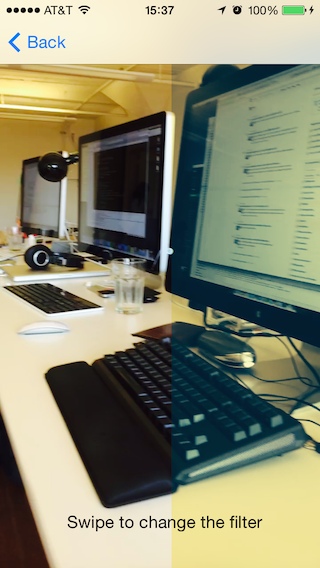

SCRecorder
===============

     

A Vine/Instagram like audio/video recorder in Objective-C.

In short, here is a short list of the cool things you can do:
- Record multiple video segments
- Remove any record segment that you don't want
- Display the result into a convenient video player
- Save the record session for later somewhere using a serializable NSDictionary (works in NSUserDefaults)
- Add a video filter using Core Image
- Merge and export the video using fine tunings that you choose


Examples for iOS are provided.

Want something easy to create your filters in this project? Checkout https://github.com/rFlex/CoreImageShop

Framework needed:
- CoreVideo
- AudioToolbox
- GLKit

Podfile
----------------

If you are using cocoapods, you can use this project with the following Podfile

```ruby
	platform :ios, '7.0'
	pod "SCRecorder", "~> 2.1"
```

Getting started
----------------

SCRecorder is the main class that connect the inputs and outputs together. It will handle all the underlying AVFoundation stuffs.

```objective-c
// Create the recorder
SCRecorder *recorder = [SCRecorder recorder];
	
// Set the sessionPreset used by the AVCaptureSession
recorder.sessionPreset = AVCaptureSessionPresetHigh;
	
// Listen to some messages from the recorder!
recorder.delegate = self;
	
// Initialize the audio and video inputs using the parameters set in the SCRecorder
[recorder openSession: ^(NSError *sessionError, NSError *audioError, NSError *videoError, NSError *photoError) {
	// Start the flow of inputs
	[recorder startRunningSession];
}];
```
	
Begin the recording
--------------------

The second class we are gonna see is SCRecordSession, which is the class that process the inputs and append them into an output file. A record session can contains one or several record segments. A record segment is just a continuous video and/or audio file, represented as a NSURL. It starts when you hold the record button and end when you release it, if you implemented the record button the same way as instagram and vine did. When you end the SCRecordSession, it will merge the record segments (if needed). If the record is started on the SCRecorder, setting a SCRecordSession inside it will automatically start a record segment. If you don't want this to happen, you must remove the SCRecordSession from the SCRecorder while manipulating it.

```objective-c
// Creating the recordSession
SCRecordSession *recordSession = [SCRecordSession recordSession];
	
// Before setting it to the recorder, you can configure many things on the recordSession,
// like the audio/video compression, the maximum record duration time, the output file url...

recorder.recordSession = recordSession;
	
[recorder record];
```	

Finishing the record
---------------------

You can call endSession on the SCRecordSession to stop the current recording segment, merge every record segments and delete the underlying files used by the record segments. Only one file will be remaining after calling this method, which will be contained in the outputUrl. Note that this property is automatically generated, but you can set one if you want to record to a specific location.

```objective-c
SCRecordSession *recordSession = recorder.recordSession;
recorder.recordSession = nil;
	
[recordSession endSession:^(NSError *error) {
	if (error == nil) {
		NSURL *fileUrl = recordSession.outputUrl;
		// Do something with the output file :)
	} else {
		// Handle the error
	}
}];
```	

And start doing the cool stuffs!
---------------------------------

```objective-c
// You can read each record segments individually
SCRecordSession *recordSession = recorder.recordSession;
for (NSURL *recordSegment in recordSession.recordSegments) {
	// Do something cool with it
}
	
// You can remove a record segment at anytime
// Setting deleteFile to YES will delete the underlying file
[recordSession removeSegmentAtIndex:1 deleteFile:YES];

// Record a square video like Vine/Instagram
recordSession.videoSizeAsSquare = YES;
	
// Or add a random record segment that you made before
[recordSession insertSegment:fileUrl atIndex:0];
	
// You can read the recordSegments easily without having to merge them
AVAsset *recordSessionAsset = [recordSession assetRepresentingRecordSegments];

// Record in slow motion! (you need to set a high framerate if you want the video to appear smooth :) )
recordSession.videoTimeScale = 4;
	
// Get a dictionary representation of the record session
// And save it somewhere, so you can use it later!
NSDictionary *dictionaryRepresentation = [recordSession dictionaryRepresentation];
[[NSUserDefaults standardUserDefaults] setObject:dictionaryRepresentation forKey:@"RecordSession"];
	
// Restore a record session from a saved dictionary representation
NSDictionary *dictionaryRepresentation = [[NSUserDefaults standardUserDefaults] objectForKey:@"RecordSession"];
SCRecordSession *recordSession = [SCRecordSession recordSession:dictionaryRepresentation];
	
// Limiting the record duration
// When the record reaches this value, the recorder will remove the recordSession and call
// recorder:didCompleteRecordSession: on the SCRecorder delegate. It's up to you
// to do whatever you want with the recordSession after (the recordSegments won't be merge nor deleted, but
// the current recordSegment will be finished automatically)
recordSession.suggestedMaxRecordDuration = CMTimeMakeWithSeconds(7, 10000);
	
// Taking a picture
[recorder capturePhoto:^(NSError *error, UIImage *image) {
	if (image != nil) {
		// Do something cool with it!
	}
}];
	
// Display your recordSession
SCVideoPlayerView *videoPlayer = [[SCVideoPlayerView alloc] init];
[videoPlayer.player setItemByAsset:recordSessionAsset];

videoPlayer.frame = self.view.bounds;
[self.view addSubView:videoPlayer];
[videoPlayer.player play];
	
// Add a view that display the video with a filter
CIFilter *blackAndWhite = [CIFilter filterWithName:@"CIColorControls" keysAndValues:@"inputBrightness", @0.0, @"inputContrast", @1.1, @"inputSaturation", @0.0, nil];
SCFilter *filter = [[SCFilter alloc] initWithCIFilter:blackAndWhite];
SCImageView *SCImageView = [SCImageView new];
SCImageView.filterGroup = [SCFilterGroup filterGroupWithFilter:filter];
SCImageView.frame = self.view.bounds;
[self.view addSubView:SCImageView];
videoPlayer.player.CIImageRenderer = SCImageView;
	
// Import a filter made using CoreImageShop
NSURL *savedFilterGroupUrl = ...;
SCFilterGroup *filterGroup = [SCFilterGroup filterGroupWithContentsOfUrl:savedFilterGroupUrl];

// Export your final video with the filter
SCAssetExportSession exportSession = [[SCAssetExportSession alloc] initWithAsset:recordSessionAsset];
exportSession.keepVideoSize = YES;
exportSession.sessionPreset = SCAssetExportSessionPresetHighestQuality;
exportSession.fileType = AVFileTypeMPEG4;
exportSession.outputUrl = [NSURL fileURLWithPath:[NSTemporaryDirectory() stringByAppendingString:@"_output.mp4"]];
exportSession.filterGroup = [SCFilterGroup filterGroupWithFilter:filter];
	
[exportSession exportAsynchronouslyWithCompletionHandler:^ {
	NSError *error = exportSession.error;
		
	// Etc...
}]
```
